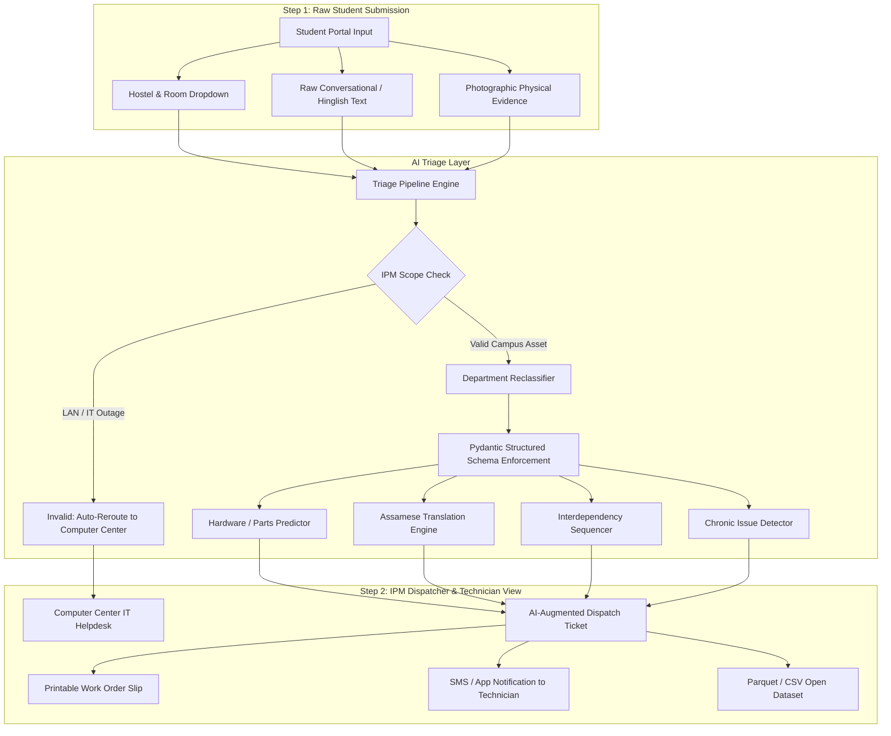

# 🛠️ AI-Augmented Triage Layer for Campus Infrastructure (IPM)
### **Granica × IIT Guwahati 48-Hour Hackathon · Physical AI Track**

> **Transforming Messy Student Complaints into Single-Visit Physical Repairs**  
> *Target User*: Campus Infrastructure Planning and Management (IPM) Dispatchers & Frontline Maintenance Technicians.

---

## 🎯 The Real-World Problem & Objective
Campus maintenance currently suffers from a major operational inefficiency: **resolving a single infrastructure complaint frequently requires 2 to 3 physical visits**.
1. **Misclassification**: Students often log complaints under the wrong department (e.g., logging a broken LAN internet port under `Electricity`, or masonry wall damage under `Carpentry`).
2. **Missing Upfront Context**: Complaints arrive without specific hardware diagnosis. Technicians arrive empty-handed, inspect the problem, return to the campus workshop for parts, and visit a second time.
3. **Trade Interdependencies**: Multi-trade jobs (e.g., masonry plaster patching required before mounting a study bookshelf) are assigned blindly to a single trade, causing cross-contractor deadlock.
4. **Language Gap**: Frontline campus technicians in Assam predominantly speak Assamese, while student tickets are submitted in conversational English or Hinglish.

### **The Intervention**
An **AI-Augmented Triage Layer** that intercepts raw student complaints, performs multimodal analysis (text + photographic evidence), and outputs a structured dispatch work order:
- **IPM Validity Check**: Filters out IT/Network issues to route directly to Computer Center (CC).
- **Department Reclassification**: Automatically corrects misclassifications into 5 IPM sections: *[Electricity, Plumbing, Carpentry, Sanitary, Other Civil Works]*.
- **Pre-Packed Tool & Hardware Prediction**: Predicts specific replacement parts (e.g., 2.5uF fan capacitor, PVC coupler, window latch handle) for single-visit resolution.
- **Assamese Frontline Directive (অসমীয়া)**: Direct native-language instructions with interactive voice synthesis.
- **Severity Scoring (1–5)**: Flags active emergencies (e.g., high-pressure water pipe flooding).
- **Chronic Failure Detection**: Identifies repeated breakdown logs (e.g., "4th time") to mandate full asset replacement.
- **Trade Interdependency Sequencing**: Structures sequential workflows (e.g., Civil masonry curing before Carpentry drilling).

---

## 🏗️ System Architecture



---

## 📋 Structured JSON Schema (`IPMTicketAnalysis`)

```json
{
  "ipm_validity": true,
  "corrected_department": "Electricity",
  "technical_summary_english": "Visual analysis confirms wall-mounted study lamp detached from electrical junction box in Lohit Hostel, Room A233, and suspended precariously on live electrical wiring. The wall mounting cavity is stripped and fractured. Requires 2-Phase Sequential Repair: Phase 1 Civil Works to fill and patch the crumbling wall gap/hole with polymer putty/mortar and allow to set, followed by Phase 2 Electrical Works to drill fresh anchor holes, secure the baseplate with wall plugs and screws, and verify circuit integrity.",
  "technician_instructions_assamese": "লোহিত হোষ্টেলৰ A233 নম্বৰ কোঠাত ২টা পৰ্যায়ৰ কাম (2-Phase Work): প্ৰথম পৰ্যায়ত চিভিল মিস্ত্ৰীয়ে দেৱালৰ খহি পৰা ফাঁক আৰু ফুটাটো ৱাল পুটি/চিমেণ্টেৰে ভৰাই সমান কৰক। শুকোৱাৰ পাছত দ্বিতীয় পৰ্যায়ত বিজুলী মিস্ত্ৰীয়ে নতুন ৱাল প্লাগ (গিট্টি) আৰু স্ক্ৰু লগাই লেম্পটো মজবুতকৈ স্থাপন কৰক আৰু টেষ্টাৰেৰে বিজুলী পৰীক্ষা কৰক।",
  "predicted_tools_parts": [
    "Phase 1 (Civil): Quick-Setting Wall Putty & White Cement (2kg)",
    "Phase 1 (Civil): Steel Putty Knife & Surface Scraper",
    "Phase 2 (Electrical): 6mm Nylon Wall Anchor Plugs (Gitti)",
    "Phase 2 (Electrical): 1.5-inch Self-Tapping Screws (M4)",
    "Phase 2 (Electrical): Insulated Line Phase Tester & Screwdriver Set",
    "Phase 2 (Electrical): Cordless Drill with 6mm Masonry Bit",
    "Phase 2 (Electrical): PVC Electrical Insulation Tape"
  ],
  "interdependency_flag": "2-Phase Trade Interdependency: Phase 1 Civil Works required to fill and patch the crumbling wall gap before Phase 2 Electrical remounting and wiring termination.",
  "severity_score": 4,
  "chronic_issue_flag": false,
  "visual_evidence_detected": [
    "detached wall study lamp",
    "hanging exposed electrical wiring",
    "damaged crumbling plaster cavity around mounting hole"
  ],
  "confidence_score": 0.98,
  "recommended_action": "2-PHASE DISPATCH: Phase 1 Civil gap filling and plaster patching first; Phase 2 Electrical remounting post-setting."
}
```

---

## 🚀 How to Run the Application

The project provides two interface options sharing the same underlying pipeline:

### Option 1: Full-Stack Web Application (Recommended)
Features a minimalist black-and-white interface, interactive demo selector, tools checklist, Assamese audio voice synthesis, printable job slip, and Parquet/CSV downloads:
```bash
# 1. Install dependencies
pip install -r requirements.txt

# 2. Start Flask Server
python app.py
```
Open **`http://127.0.0.1:5001`** in your browser.

### Option 2: Streamlit Dashboard
```bash
streamlit run streamlit_app.py
```
Open the generated local URL (e.g., `http://localhost:8501`).

---

## 🤖 How We Used AI

We integrated the **Google Gemini Multimodal API** (`gemini-3.5-flash`) via the official Google GenAI SDK (`google.genai`) to power the triage and augmentation layer:
- **API Key & Secure Authentication**: The backend securely loads `GEMINI_API_KEY` from the environment (`.env`) or the client settings modal to authenticate requests with `genai.Client(api_key=resolved_key)`.
- **Multimodal Physical Inspection**: Both unstructured student complaint text and high-resolution photo evidence are fed concurrently into Gemini to visually inspect physical asset damage (e.g. wall fractures, unhinged lamp fixtures, live exposed wiring).
- **Strict Structured Output Generation**: By passing our Pydantic schema into `response_schema=IPMTicketAnalysis` with `response_mime_type="application/json"`, Gemini is constrained to return strictly valid, deterministic JSON matching all fields (severity, tools, directives) without hallucinations.
- **Scope Invalidation & Department Triage**: Prompt engineering instructs Gemini on IIT Guwahati IPM maintenance boundaries, automatically re-routing non-IPM complaints (e.g. LAN outages to CCC, missing furniture to Hostel Office) and correcting misclassified student categories.
- **2-Phase Sequential Breakdown**: When physical damage spans multiple disciplines, Gemini structures sequential workflows (e.g. Phase 1 Civil gap filling and plaster patching before Phase 2 Electrical remounting).
- **Colloquial Assamese Frontline Translation**: Gemini translates dispatcher situational summaries into direct, colloquial Assamese instructions (`technician_instructions_assamese`) paired with predicted toolkits for single-visit resolution.

---

## ⚡ Real Campus Scenarios (IIT Guwahati)

| Scenario ID | Hostel & Location | Raw Student Complaint | Input Category | AI Reclassified Dept | Key AI Augmentation |
| :--- | :--- | :--- | :--- | :--- | :--- |
| `TICKET-WALL-01` | Umiam · Room 102 | *"paint the wall"* | Carpentry | **Other Civil Works** | Reclassified from Carpentry; identifies graffiti and chipped plaster; packs putty, paint, and brush |
| `TICKET-WALL-02` | Umiam · Room 102 | *"plaster chipping off and graffiti on wall"* | Other Civil Works | **Other Civil Works** | Validates civil works; prescribes surface preparation, plaster repair, and sanding |
| `TICKET-LAMP-01` | Lohit · Room A233 | *"broken thing."* | Plumbing | **Electricity** | Reclassified from Plumbing; flags shock hazard; mandates **2-Phase Repair** (Civil gap fill $\rightarrow$ Electrical remount) |
| `TICKET-NON-IPM-LAN` | Kapili · Room 308 | *"Connecting laptop with lan shows no internet"* | Electricity | **Invalid (IT)** | Scope Invalidation: Out of IPM scope; auto-redirects to CCC complaint portal |
| `TICKET-NON-IPM-FURN` | Disang · Room 214 | *"no table and chair in my hostel room"* | Carpentry | **Invalid (Hostel Admin)** | Scope Invalidation: Out of IPM scope; auto-redirects to Hostel Office |

---

## 📊 Dataset & Hackathon Submission Artefacts
- **Parquet Dataset**: [`data/ipm_triaged_tickets.parquet`](file:///Users/devalsinghal/Downloads/Granica/data/ipm_triaged_tickets.parquet)
- **CSV Dataset**: [`data/ipm_triaged_tickets.csv`](file:///Users/devalsinghal/Downloads/Granica/data/ipm_triaged_tickets.csv)
- **Schema Documentation**: [`data/schema_documentation.md`](file:///Users/devalsinghal/Downloads/Granica/data/schema_documentation.md)

### Real vs. Synthetic Data Split
- **Observed Real Data (100%)**: Complaint texts, historical hostel logs, room numbers, and photographic physical evidence collected through interviews with hostel maintenance secretaries and students across 8 IIT Guwahati hostels.
- **Inferred AI Data**: Classification corrections, severity scoring, hardware requirements, Assamese translations, and trade dependency mapping.
- **Synthetic Data (0%)**: No synthetic text. Real infrastructure failure patterns reflect authentic student reporting styles.
