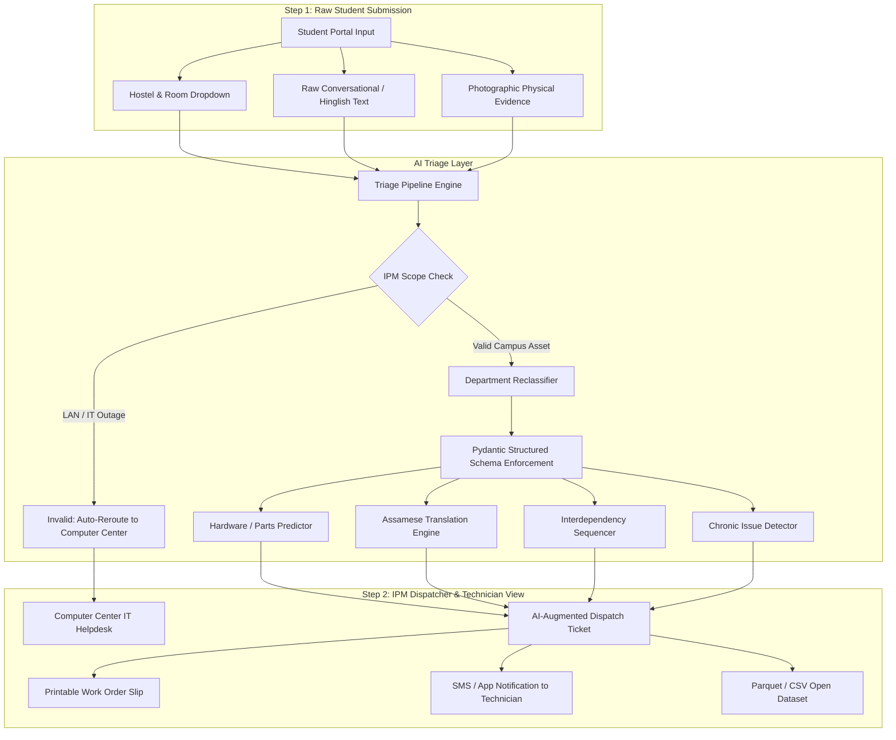

# 🛠️ AI-Augmented Triage Layer for Campus Infrastructure (IPM)
### **Granica × IIT Guwahati 48-Hour Hackathon · Physical AI Track**

> **Transforming Messy Student Complaints into Single-Visit Physical Repairs**  
> *Target User*: Campus Infrastructure Planning and Management (IPM) Dispatchers & Frontline Maintenance Technicians.

---

## 🎯 The Real-World Problem & Objective
Campus maintenance currently suffers from a major operational inefficiency: **resolving a single infrastructure complaint frequently requires 2 to 3 physical visits**.
1. **Misclassification**: Students often log complaints under the wrong department (e.g., logging a broken LAN internet port under `Electricity`, or masonry wall damage under `Carpentry`).
2. **Missing Upfront Context**: Complaints arrive without specific hardware diagnosis. Technicians arrive empty-handed, inspect the problem, return to the campus workshop for parts, and visit a second time.
3. **Trade Interdependencies**: Multi-trade jobs (e.g., masonry plaster patching required before mounting a study bookshelf) are assigned blindly to a single trade, causing cross-contractor deadlock.
4. **Language Gap**: Frontline campus technicians in Assam predominantly speak Assamese, while student tickets are submitted in conversational English or Hinglish.

### **The Intervention**
An **AI-Augmented Triage Layer** that intercepts raw student complaints, performs multimodal analysis (text + photographic evidence), and outputs a structured dispatch work order:
- **IPM Validity Check**: Filters out IT/Network issues to route directly to Computer Center (CC).
- **Department Reclassification**: Automatically corrects misclassifications into 5 IPM sections: *[Electricity, Plumbing, Carpentry, Sanitary, Other Civil Works]*.
- **Pre-Packed Tool & Hardware Prediction**: Predicts specific replacement parts (e.g., 2.5uF fan capacitor, PVC coupler, window latch handle) for single-visit resolution.
- **Assamese Frontline Directive (অসমীয়া)**: Direct native-language instructions with interactive voice synthesis.
- **Severity Scoring (1–5)**: Flags active emergencies (e.g., high-pressure water pipe flooding).
- **Chronic Failure Detection**: Identifies repeated breakdown logs (e.g., "4th time") to mandate full asset replacement.
- **Trade Interdependency Sequencing**: Structures sequential workflows (e.g., Civil masonry curing before Carpentry drilling).

---

## 🏗️ System Architecture



---

## 📋 Structured JSON Schema (`IPMTicketAnalysis`)

```json
{
  "ipm_validity": true,
  "corrected_department": "Plumbing",
  "technical_summary_english": "High-pressure potable water inlet PVC pipe ruptured beneath corridor water cooler unit. Active water leakage causing floor flooding with audible electronic filter/float sensor alarm triggered.",
  "technician_instructions_assamese": "ৰুম ২৭৪ ৰ ওচৰৰ ৱাটাৰ কুলাৰৰ তলৰ ফাটি যোৱা PVC পানীৰ পাইপ তৎকালীনভাৱে মেৰামতি কৰক আৰু বিপিং চেন্সৰ পৰীক্ষা কৰক। মজিয়াত পানী জমা হৈছে।",
  "predicted_tools_parts": [
    "1/2-inch Heavy Duty PVC Pipe Coupler",
    "CPVC Solvent Cement (100ml)",
    "Adjustable Pipe Wrench (12-inch)",
    "Water Cooler Float Sensor Probe & Teflon Tape"
  ],
  "interdependency_flag": null,
  "severity_score": 5,
  "chronic_issue_flag": false,
  "visual_evidence_detected": [
    "Transverse fracture in blue PVC water pipe",
    "Active pressurized water stream escaping",
    "Substantial puddle and floor slip hazard"
  ],
  "confidence_score": 0.98,
  "recommended_action": "EMERGENCY DISPATCH: Shut off main corridor valve immediately, dispatch plumber with PVC couplers."
}
```

---

## 🚀 How to Run the Application

The project provides two interface options sharing the same underlying pipeline:

### Option 1: Full-Stack Web Application (Recommended)
Features custom dark-mode glassmorphism, live demo carousel, interactive tools checklist, Assamese audio voice synthesis, printable job slip, and Parquet/CSV downloads:
```bash
# 1. Install dependencies
pip install -r requirements.txt

# 2. Start Flask Server
python app.py
```
Open **`http://127.0.0.1:5001`** in your browser.

### Option 2: Streamlit Dashboard
```bash
streamlit run streamlit_app.py
```
Open the generated local URL (e.g., `http://localhost:8501`).

---

## ⚡ Pre-Loaded Historical Demo Cases (IIT Guwahati)

| Ticket ID | Hostel & Location | Raw Student Complaint | AI Corrected Dept | Key AI Intervention |
| :--- | :--- | :--- | :--- | :--- |
| `086103` | Umiam · Rm 274 Corridor | *"Water cooler pipe me leakage ho gya he, beep beep noise..."* | **Plumbing** | **Severity 5 Emergency**: Flooding risk; predicts PVC coupler & cement |
| `057088` | Kapili · Room 308 | *"Connecting laptop with lan shows no internet, yellow light..."* | **Invalid (IT)** | **Scope Invalidation**: Re-routes out of IPM to Computer Center (CC) |
| `142046` | Kameng · Room 119 | *"My fan is creating noise, 4th time posting complaint! Every time technician comes and adds oil..."* | **Electricity** | **Chronic Issue Flag**: Mandates full new 1200mm fan replacement |
| `141190` | Siang · Room 205 | *"Holes and cracks in walls... want to fix bookshelf but concrete crumbling..."* | **Other Civil Works** | **Interdependency**: Civil masonry patching required BEFORE Carpentry |
| `105873` | Manas · Room 412 | *"Windows are not opening properly, no handle, rain coming inside..."* | **Carpentry** | **Hardware Prediction**: Aluminum casement handle, M4.5 screws, wood plane |
| `082936` | Dihing · Room 114 | *"Change Fan Condeser. Room fan is running very slow speed..."* | **Electricity** | **Single-Visit Fix**: Packs 2.5uF 440V capacitor before dispatch |
| `088651` | Barak · BT-02 & BS-01 | *"Shower tap not working in BT-02. Tower bolt lock fixed in Bs-01"* | **Plumbing** | **Split Ticket**: Dual assignment for Plumbing fixture + Carpentry bolt |

---

## 📊 Dataset & Hackathon Submission Artefacts
- **Parquet Dataset**: [`data/ipm_triaged_tickets.parquet`](file:///Users/devalsinghal/Downloads/Granica/data/ipm_triaged_tickets.parquet)
- **CSV Dataset**: [`data/ipm_triaged_tickets.csv`](file:///Users/devalsinghal/Downloads/Granica/data/ipm_triaged_tickets.csv)
- **Schema Documentation**: [`data/schema_documentation.md`](file:///Users/devalsinghal/Downloads/Granica/data/schema_documentation.md)

### Real vs. Synthetic Data Split
- **Observed Real Data (100%)**: Complaint texts, historical hostel logs, room numbers, and photographic physical evidence collected through interviews with hostel maintenance secretaries and students across 8 IIT Guwahati hostels.
- **Inferred AI Data**: Classification corrections, severity scoring, hardware requirements, Assamese translations, and trade dependency mapping.
- **Synthetic Data (0%)**: No synthetic text. Real infrastructure failure patterns reflect authentic student reporting styles.
