# AI-Augmented Triage Layer for Campus Infrastructure (IPM)
### **Granica x IIT Guwahati 48-Hour Hackathon · Physical AI Track**

> **Transforming Messy Student Complaints into Single-Visit Physical Repairs**  
> *Target User*: Campus Infrastructure Planning and Management (IPM) Dispatchers & Frontline Maintenance Technicians.

---

## The Real-World Problem & Objective
Campus maintenance currently suffers from a major operational inefficiency: **resolving a single infrastructure complaint frequently requires 2 to 3 physical visits**.
1. **Misclassification**: Students often log complaints under the wrong department (e.g., logging a broken LAN internet port under `Electricity`, or masonry wall damage under `Carpentry`).
2. **Missing Upfront Context**: Complaints arrive without specific hardware diagnosis. Technicians arrive empty-handed, inspect the problem, return to the campus workshop for parts, and visit a second time.
3. **Trade Interdependencies**: Multi-trade jobs (e.g., civil masonry hole filling required before electrical mounting) are assigned blindly to a single trade, causing cross-contractor delays and repeated visits.
4. **Language Gap**: Frontline campus technicians in Assam predominantly speak Assamese, while student tickets are submitted in conversational English or Hinglish.

### The Intervention
An **AI-Augmented Triage Layer** that intercepts raw student complaints, performs multimodal analysis (text + photographic evidence), and outputs a structured dispatch work order:
- **IPM Validity Check**: Filters out IT/Network complaints to route directly to Computer & Communication Centre (CCC) and furniture requests to Hostel Office.
- **Department Reclassification**: Automatically corrects misclassifications into 5 IPM sections: *[Electricity, Plumbing, Carpentry, Sanitary, Other Civil Works]*.
- **Pre-Packed Tool & Hardware Prediction**: Predicts specific tools and replacement parts grouped by phase for single-visit resolution.
- **Assamese Frontline Directive (অসমীয়া)**: Direct native-language instructions with interactive voice synthesis.
- **Severity Scoring (1–5)**: Flags emergencies and safety hazards (e.g., hanging live electrical wires).
- **Multi-Trade Sequencing**: Formulates sequential workflows (e.g., Phase 1 Civil wall filling and curing before Phase 2 Electrical remounting).

---

## How We Used AI
We integrated the Google Gemini Multimodal Vision API (`gemini-3.5-flash`) via the official Google GenAI SDK to simultaneously analyze unstructured conversational student text and high-resolution photographic evidence. By configuring `response_mime_type="application/json"` and passing our strict `IPMTicketAnalysis` Pydantic model directly into `response_schema`, Gemini is constrained to return deterministically structured, schema-compliant JSON work orders without format hallucinations. This enables instant extraction of physical defect signatures, severity metrics, trade interdependencies, required hardware inventory, and colloquial Assamese technician directives.

---

## System Architecture

```mermaid
flowchart TD
    subgraph InputLayer ["1. Student Input Layer"]
        A["Student Portal Submission"] --> B["Hostel & Room Location"]
        A --> C["Conversational Raw Text / Voice Simulation"]
        A --> D["Photographic Physical Evidence (Camera Capture)"]
    end

    subgraph MultimodalCore ["2. AI Triage Engine (Google Gemini Vision API)"]
        B & C & D --> E["Multimodal Payload Assembler"]
        E --> F["Google GenAI Client (gemini-3.5-flash)"]
        F --> G["Structured Schema Enforcement (IPMTicketAnalysis)"]
        
        G --> H{"Scope Verification"}
        H -- "IT / Network (e.g., LAN Outage)" --> I["Invalid: Route to Computer & Communication Centre (CCC)"]
        H -- "Hostel Admin (e.g., Missing Furniture)" --> J["Invalid: Route to Hostel Office"]
        H -- "Valid Physical Asset" --> K["Department Triage & Reclassification"]
        
        K --> L["Sequential Phase Breakdown & Trade Interdependency"]
        K --> M["Pre-Packed Inventory & Hardware Checklist Generator"]
        K --> N["Assamese Technician Directive Engine (অসমীয়া)"]
        K --> O["Severity & Hazard Assessment (Levels 1-5)"]
    end

    subgraph OutputLayer ["3. Dispatcher & Frontline Technician Interface"]
        I --> P["CCC Helpdesk Redirect Notice"]
        J --> Q["Hostel Office Administrative Notice"]
        L & M & N & O --> R["Augmented Dispatch Work Order Card"]
        R --> S["Printable Field Work Order Slip"]
        R --> T["Web Speech Native Audio Readout"]
        R --> U["Columnar Parquet & CSV Dataset Export"]
    end
```



### Architecture Components
1. **Multimodal Ingestion**: Ingests hostel residence, room number, unverified student text, and attached JPEG/PNG images from phone camera captures.
2. **Schema-Constrained Reasoning**: Leverages Gemini 3.5 Flash with structured Pydantic schemas (`IPMTicketAnalysis`) to guarantee parseable JSON without regex post-processing.
3. **Multi-Trade Interdependency Engine**: Automatically decomposes complex repairs into sequential phases (e.g., Phase 1 Civil wall filling and curing followed by Phase 2 Electrical anchor drilling and wiring).
4. **Dual Dispatch Surface**: Serves dispatchers via a responsive web dashboard, field technicians via printable slips with Assamese audio synthesis, and campus administrators via Parquet/CSV data exports.

---

## Structured JSON Schema (IPMTicketAnalysis)

```json
{
  "ipm_validity": true,
  "corrected_department": "Electricity",
  "technical_summary_english": "Visual analysis confirms wall-mounted study lamp detached from electrical junction box in Lohit Hostel, Room A233, and suspended precariously on live electrical wiring. The wall mounting cavity is stripped and fractured. Requires 2-Phase Sequential Repair: Phase 1 Civil Works to fill and patch the crumbling wall gap/hole with polymer putty/mortar and allow to set, followed by Phase 2 Electrical Works to drill fresh anchor holes, secure the baseplate with wall plugs and screws, and verify circuit integrity.",
  "technician_instructions_assamese": "লোহিত হোষ্টেলৰ A233 নম্বৰ কোঠাত ২টা পৰ্যায়ৰ কাম (2-Phase Work): প্ৰথম পৰ্যায়ত চিভিল মিস্ত্ৰীয়ে দেৱালৰ খহি পৰা ফাঁক আৰু ফুটাটো ৱাল পুটি/চিমেণ্টেৰে ভৰাই সমান কৰক। শুকোৱাৰ পাছত দ্বিতীয় পৰ্যায়ত বিজুলী মিস্ত্ৰীয়ে নতুন ৱাল প্লাগ (গিট্টি) আৰু স্ক্ৰু লগাই লেম্পটো মজবুতকৈ স্থাপন কৰক আৰু টেষ্টাৰেৰে বিজুলী পৰীক্ষা কৰক।",
  "predicted_tools_parts": [
    "Phase 1 (Civil): Quick-Setting Wall Putty & White Cement (2kg)",
    "Phase 1 (Civil): Steel Putty Knife & Surface Scraper",
    "Phase 2 (Electrical): 6mm Nylon Wall Anchor Plugs (Gitti)",
    "Phase 2 (Electrical): 1.5-inch Self-Tapping Screws (M4)",
    "Phase 2 (Electrical): Insulated Line Phase Tester & Screwdriver Set",
    "Phase 2 (Electrical): Cordless Drill with 6mm Masonry Bit",
    "Phase 2 (Electrical): PVC Electrical Insulation Tape"
  ],
  "interdependency_flag": "2-Phase Trade Interdependency: Phase 1 Civil Works required to fill and patch the crumbling wall gap before Phase 2 Electrical remounting and wiring termination.",
  "severity_score": 4,
  "chronic_issue_flag": false,
  "visual_evidence_detected": [
    "detached wall study lamp",
    "hanging exposed electrical wiring",
    "damaged crumbling plaster cavity around mounting hole"
  ],
  "confidence_score": 0.98,
  "recommended_action": "2-PHASE DISPATCH: Phase 1 Civil gap filling and plaster patching first; Phase 2 Electrical remounting post-setting."
}
```

---

## How to Run the Application

The project provides two interface options sharing the same underlying pipeline:

### Option 1: Full-Stack Web Application (Recommended)
Features a minimalist monochrome interface, scenario selector, interactive tools checklist, Assamese audio voice synthesis, printable job slip, and Parquet/CSV downloads:
```bash
# 1. Install dependencies
pip install -r requirements.txt

# 2. Configure Environment (Optional - Gemini API Key)
# Add your key to .env: GEMINI_API_KEY=your_key_here

# 3. Start Flask Server
python app.py
```
Open **`http://127.0.0.1:5001`** in your browser.

### Option 2: Streamlit Dashboard
```bash
streamlit run streamlit_app.py
```
Open the generated local URL (e.g., `http://localhost:8501`).

---

## Dataset & Hackathon Submission Artefacts
- **Parquet Dataset**: [`data/ipm_triaged_tickets.parquet`](file:///Users/devalsinghal/Downloads/Granica/data/ipm_triaged_tickets.parquet)
- **CSV Dataset**: [`data/ipm_triaged_tickets.csv`](file:///Users/devalsinghal/Downloads/Granica/data/ipm_triaged_tickets.csv)
- **Schema Documentation**: [`data/schema_documentation.md`](file:///Users/devalsinghal/Downloads/Granica/data/schema_documentation.md)

### Real vs. Synthetic Data Split
- **Observed Real Data (100%)**: Complaint texts, historical hostel logs, room numbers, and photographic physical evidence collected through interviews with hostel maintenance secretaries and students across IIT Guwahati hostels.
- **Inferred AI Data**: Classification corrections, severity scoring, hardware requirements, Assamese translations, and trade dependency mapping.
- **Synthetic Data (0%)**: No synthetic text. Real infrastructure failure patterns reflect authentic student reporting styles.
